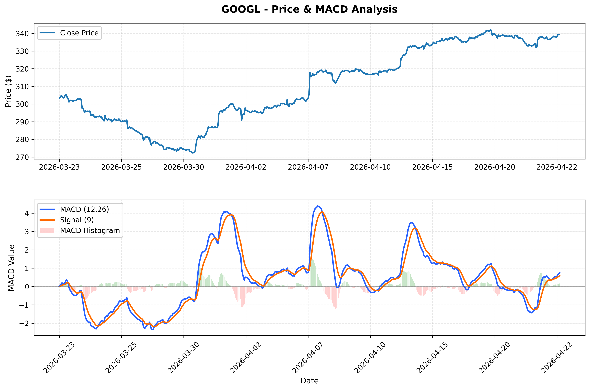
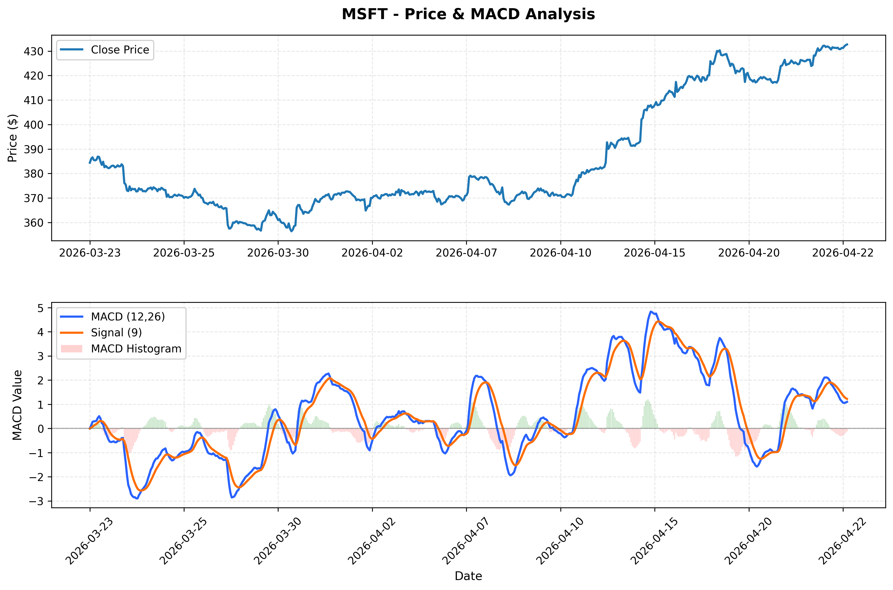
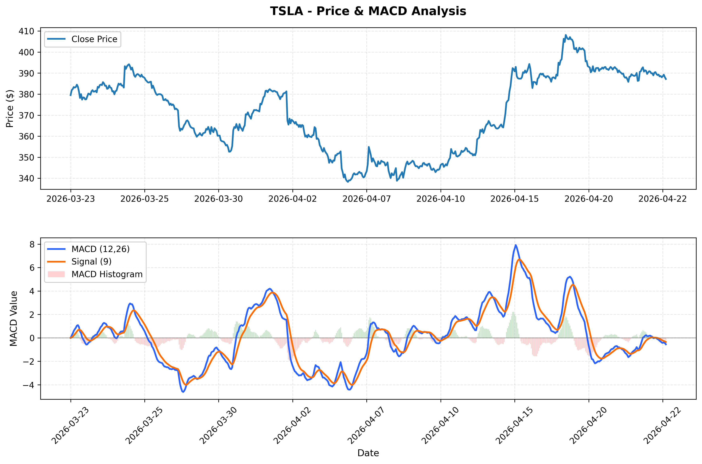

# MACD Analysis Notebook

This project analyzes intraday stock momentum using the MACD indicator and generates price + MACD visualizations for five large-cap tickers.

## Project Files

- `MACD.ipynb`: Notebook that downloads data, computes MACD, and plots results.
- `ticker_AAPL_macd_analysis.png`
- `ticker_GOOGL_macd_analysis.png`
- `ticker_MSFT_macd_analysis.png`
- `ticker_AMZN_macd_analysis.png`
- `ticker_TSLA_macd_analysis.png`

## What the Notebook Does

1. Downloads 1 month of 15-minute OHLCV data from Yahoo Finance.
2. Calculates:
   - MACD line: `EMA(12) - EMA(26)`
   - Signal line: `EMA(MACD, 9)`
   - Histogram: `MACD - Signal`
3. Creates a two-panel chart for each ticker:
   - Top panel: close price
   - Bottom panel: MACD line, signal line, histogram
4. Saves each chart as a PNG image.

## Tickers Included

- AAPL
- GOOGL
- MSFT
- AMZN
- TSLA

## Requirements

Install dependencies:

```bash
pip install yfinance pandas numpy matplotlib mplfinance
```

## How to Run

1. Open `MACD.ipynb`.
2. Run cells from top to bottom.
3. Review charts in the notebook.
4. PNG outputs are saved in the project root.

## Output Charts

### AAPL


### GOOGL



### MSFT



### AMZN


### TSLA



## Notes

- MACD is a lagging momentum indicator and should be used with additional confirmation.
- Chart timestamps follow the downloaded market data interval.
- You can edit the `tickers` list and MACD periods in the notebook to customize analysis.
